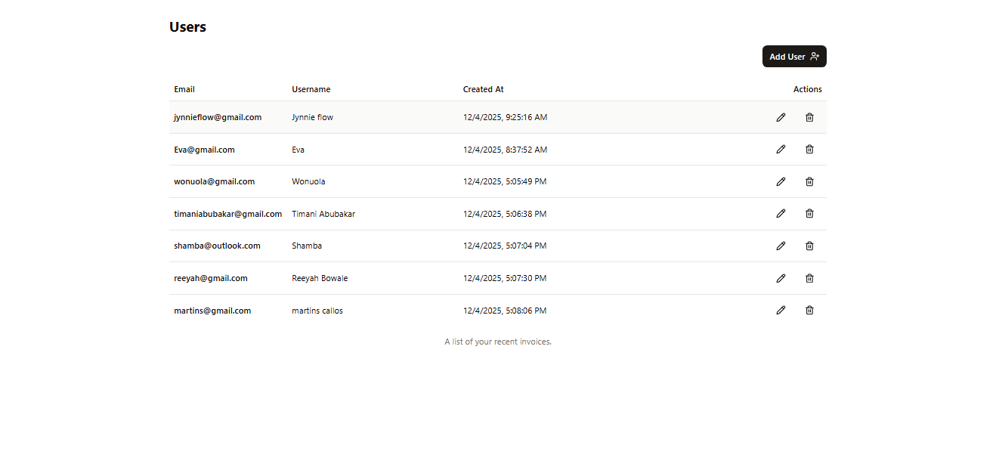

#📦 CRUD APPLICATION

## 📘 Overview
This is a Full stack CRUD (Create, Read, Update, Delete) application built with React, Next.js, Typescript, Postgresql, Shadcn, Tailwindcss.
It allows users to create, view, update and delete items in a clean and responsive interface.

## ✨ Features
- Add new user
- View list of all users
- Update/Edit previous user
- Delete user
- Fully responsive UI

## 🛠 Tech Stack
- Frontend: React/ Next.js/ Typescript/ Shadcn-ui/ Tailwindcss.
- Backend: PostgreSQL

## 🚀 How It Works
- Open the app to view the **main dashboard** displaying all user names.
- Click the **Add New** to add a new user.
- Click the **Pen Icon** to edit a user.
- Click the **Trash Icon** to delete a user.
- All changes update instantly in the database.

## 📌 Screenshots:

## Main Dashboard

## Add New User

## Edit User

## Delete User

## 📝 Installation
1. Clone the repository
2. Install dependencies
3. Run the application

## 📝 Usage
1. Open the app in your browser
2. Add, view, update and delete users

## 📝 Contributing
Contributions are welcome! Please read the [contributing guidelines](CONTRIBUTING.md) before submitting a pull request.

## 📝 License
This project is licensed under the MIT License - see the [LICENSE](LICENSE) file for details.
