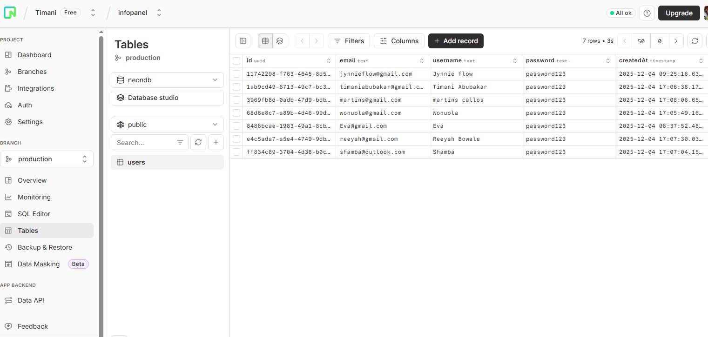

#📦 CRUD APPLICATION

## 📘 Overview
This project is a full-stack web application built using the Next.js framework(App Router model) and Typescript. It follows a modern, vertically-integrated architecture where the frontend and backend logic are tightly coupled within the same Next.js project.

## ✨ Features
- Add new user
- View list of all users
- Update/Edit previous user
- Delete user
- Fully responsive UI

## 🚀 How It Works
- Open the app to view the **main dashboard** displaying all user names.
- Click the **Add New** to add a new user.
- Click the **Pen Icon** to edit a user.
- Click the **Trash Icon** to delete a user.
- All changes update instantly in the UI.

## 🛠 Development Process & Technology Stack:

1. Core Framework: The application is structured around Next.js 15, using its latest features like React Server  Components(RSCs), Server Actions, and a file-based routing system.

2. Database and ORM: A postgreSQL database handles all data storage for the application. The application interacts with the database via Drizzle ORM, a TypeScript ORM designed to work seamlessly with Next.js and PostgreSQL. The database schema, defining the users table, is clearly laid out in the db/schema.ts file.

3. Backend Logic: Instead of a traditional REST or GraphQL API, the backend is built with Next.js Server Actions. These are asynchronous server-side functions defined in server/user.ts that handles all Create, Read, Update, and Delete (CRUD) operations. These actions are called directly from frontend components, improving data flow while removing unnecessary setup code.

4. Frontend & UI:
 - The user interface is built with React and composed of both react server components(for server-rendered, non-interactive parts like the main user table) and Client Components(for interactive elements like forms and buttons).
 - Styling is handled by tailwindcss, using reusable styles to designs quickly and consistently.
 - This project uses Radix UI components as a base, and custom styles are added in files such as components/ui/button.
 -User input is managed through forms built with react-hook-form and validated on the client side using schemas defined with zod.

 ## ✔ Data Flow Example(User Creation):
 1. The user interacts with a client-side React component(e.g, a form).
 2. When the form is submitted, the component directly calls a server action such as createUser.
 3. The server action runs on the server and uses Drizzle ORM to handle the SQL query on the postgreSQL database.
 4. Once the database operation is complete, the server action returns a response to the client and the client UI updates accordingly.

## 📌 Screenshots:

## Main Dashboard

## Add New User

## Edit User

## Delete User

## Database

## 📝 Installation
1. Clone the repository
2. Install dependencies
3. Run the application

## 📝 Usage
1. Open the app in your browser
2. Add, view, update and delete users

## 📝 Contributing
Contributions are welcome! Please read the [contributing guidelines](CONTRIBUTING.md) before submitting a pull request.

## 📝 License
This project is licensed under the MIT License - see the [LICENSE](LICENSE) file for details.
